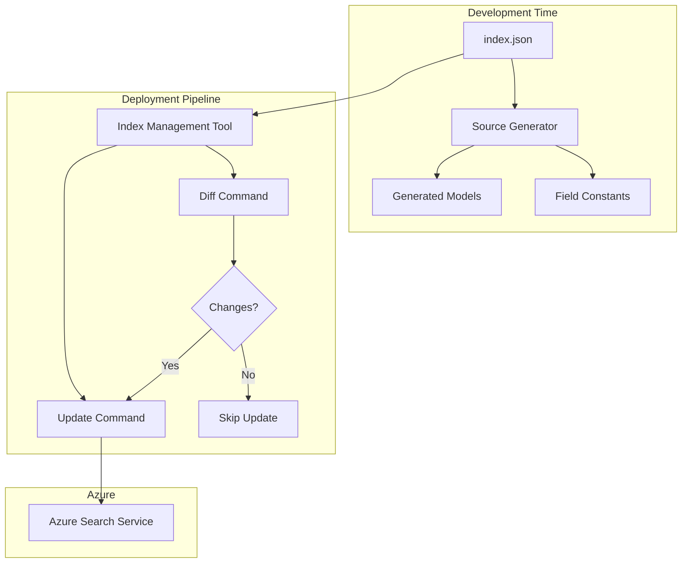

# Index as Code Pattern for Azure AI Search

## What is Index as Code?

Index as Code is a pattern for managing Azure AI Search indexes where the index definition JSON file in your codebase serves as the single source of truth. This pattern brings infrastructure-as-code principles to search index management, enabling version control, automated testing, and consistent deployments.

## Key Benefits

- **Version Control**: Track all changes to your search index over time
- **Automated Testing**: Test index changes before deployment
- **Environment Parity**: Ensure development, staging, and production indexes stay in sync
- **Type Safety**: Generate strongly-typed models and field references
- **CI/CD Integration**: Automate index updates in your deployment pipeline

## Architecture

### 1. Source of Truth
The `.index.json` file in your codebase defines:
- Index name and settings
- Field definitions and types
- Complex type structures
- Field attributes (searchable, filterable, etc.)

### 2. Development Time Features
The source generator provides:
- C# POCO classes matching your index schema
- Strongly-typed field name constants
- Compile-time validation of your index definition

### 3. Deployment Pipeline
The CLI tools enable:
- Comparing local and remote index definitions
- Safe updates with change detection
- Optional index name overrides for different environments

## Best Practices

### Version Control
- Keep index definitions in the same repository as your application code
- Review index changes like any other code change
- Use meaningful commit messages for index modifications

### Development Workflow
1. Modify the index definition JSON
2. Build to generate updated models
3. Update application code using the generated types
4. Test locally
5. Commit changes

### Deployment Workflow
1. Run diff command to preview changes
2. Apply updates only if changes are expected
3. Use different index names for different environments
4. Consider using blue-green deployment for major changes

### Environment Management
- Use index name overrides for different environments
- Consider creating staging indexes for testing
- Maintain parallel indexes for zero-downtime updates

## Implementation Guide

See the following documentation for detailed implementation steps:
- [Getting Started Guide](getting-started.md) - Initial setup
- [Index Management Tool](index-management-tool.md) - CLI usage
- [Deployment Scripts](scripts/) - Automation examples

## Flow Diagram

This diagram illustrates how:
1. The index.json file is the single source of truth
2. The Source Generator creates development-time artifacts
3. The Index Management Tool handles deployment synchronization
4. Changes are safely propagated to Azure Search